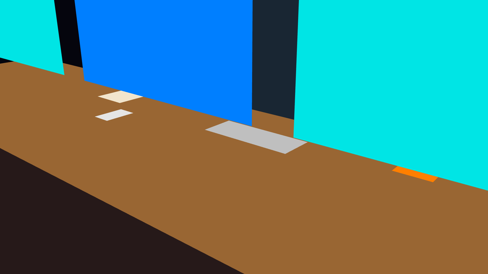
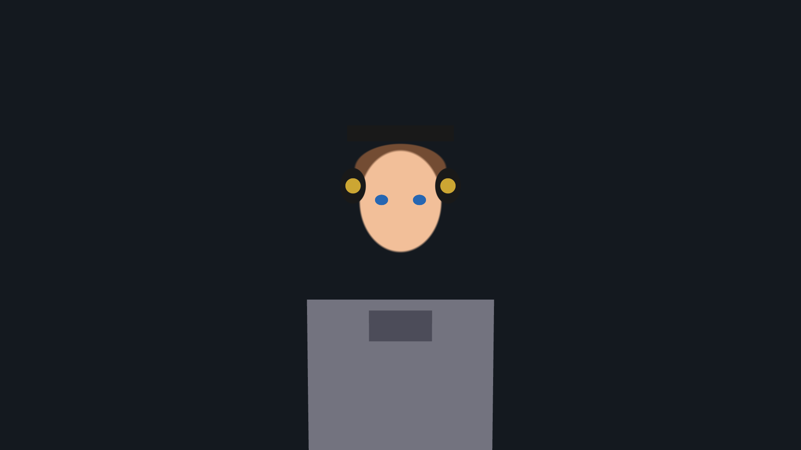
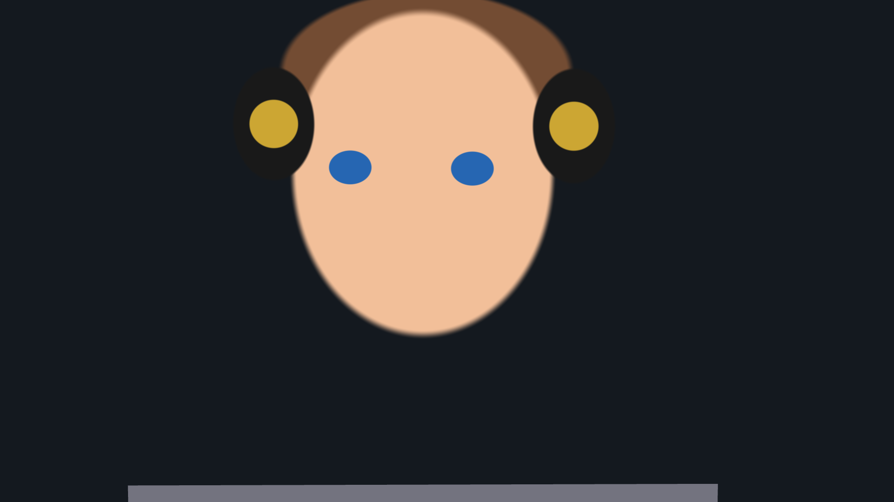
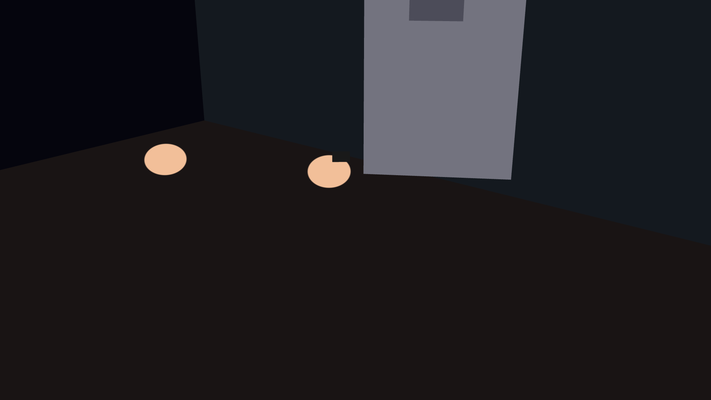
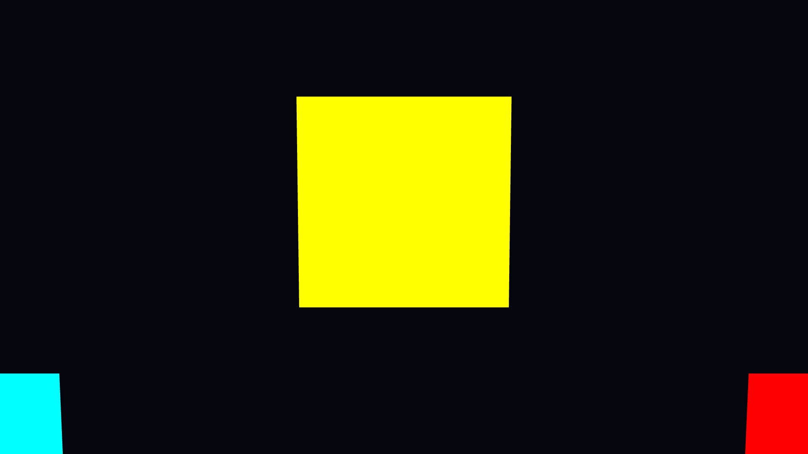

# Trade Fix Radio Visual System

The visual system renders an animated radio studio scene for the Trade Fix Radio broadcast. It creates an immersive 3D environment featuring an AI DJ character, studio equipment, and dynamic camera movements synchronized with the music and market state.

---

## Architecture Overview

```
MARKET STATE  →  VISUAL DIRECTOR  →  CAMERA DIRECTOR  →  SCENE STATE
                                                              |
                                                              v
                          FASTAPI SERVICE  ←→  WEBSOCKET BRIDGE
                                                              |
                                                              v
                                           WEBGL2 RENDERER (app.js)
                                                              |
                                                              v
                                              CANVAS OUTPUT → OBS
```

The visual system runs as a separate service that receives state updates via WebSocket and renders the scene in real-time using WebGL2.

---

## Components

### Python Backend

| Module | Purpose |
|--------|---------|
| `tradefix_radio/visual/service.py` | FastAPI server serving the WebGL runtime and providing scene data API |
| `tradefix_radio/visual/scene.py` | Scene definition with room geometry, furniture, and character positioning |
| `tradefix_radio/visual/camera.py` | Camera definitions with positions, targets, and field of view |
| `tradefix_radio/visual/camera_director.py` | Intelligent camera switching based on market state and music |
| `tradefix_radio/visual/director.py` | Visual state management and animation timing |
| `tradefix_radio/visual/geometry.py` | 3D geometry utilities and matrix operations |
| `tradefix_radio/visual/assets.py` | Asset management for textures and models |
| `tradefix_radio/visual/art.py` | Art asset definitions and loading |
| `tradefix_radio/visual/demo.py` | Demo mode for standalone testing |

### WebGL Frontend

| File | Purpose |
|------|---------|
| `visual/runtime/app.js` | Main WebGL2 renderer with SDF shaders |
| `visual/runtime/index.html` | HTML shell with canvas and HUD overlay |
| `visual/runtime/art.js` | Art asset rendering utilities |
| `visual/runtime/proof.js` | Diagnostic and proof-of-render utilities |

---

## Scene Layout

The studio is a 6m × 6m × 3m room with the following elements:

### Room Surfaces
- **Floor**: 6000mm × 6000mm base surface
- **Back Wall**: Full height wall behind the desk
- **Side Walls**: Left and right walls for depth
- **Ceiling**: Overhead surface (typically not visible)

### Desk Setup
- **Main Desk**: 1800mm × 800mm workspace
- **Primary Monitor**: 27" display centered above desk
- **Secondary Monitors**: Additional displays for market data
- **Keyboard & Mouse**: Input devices on desk surface
- **Coffee Mug**: Signature prop item
- **Notebook**: Reference materials

### Character (AI DJ)
- **Head**: Main focal point with face rendering
- **Torso**: Upper body with hoodie
- **Arms**: Animated limbs for gestures
- **Headphones**: Audio equipment with gold accents
- **Eyes**: Expressive rendering for personality

---

## Camera System

The visual system features 7 distinct camera angles:

| Camera | Name | Purpose | FOV |
|--------|------|---------|-----|
| CAM_1 | HERO FRONT | Main broadcast angle | 22.9° |
| CAM_2 | HERO LEFT | Side profile shot | 22.9° |
| CAM_3 | HERO RIGHT | Reverse side profile | 22.9° |
| CAM_4 | WIDE | Full room establishing | 45.7° |
| CAM_5 | WIDE OFFICE | Room geometry view | 45.7° |
| CAM_6 | HANDS | Close-up of desk work | 22.9° |
| CAM_7 | OVERHEAD | Top-down perspective | 34.3° |

### Camera Director

The camera director automatically selects shots based on:
- Current market regime (volatile = more cuts)
- Music energy level
- Time since last cut
- Shot variety (avoids repeating same angle)

---

## Diagnostic System

The visual system includes comprehensive render diagnostics for verification:

### Diagnostic Modes

Access via URL parameters: `?render_test=<mode>&hud=0`

| Mode | Tests | Expected Results |
|------|-------|------------------|
| `world_marker` | Basic WebGL rendering | 3 colored cubes visible |
| `room` | Room geometry | Floor, walls visible with >15% coverage |
| `desk` | Desk setup | All 7 desk items visible |
| `character` | DJ character | 5 body parts visible including head/torso |

### Running Diagnostics

```powershell
# Start the visual server
.\.venv\Scripts\tradefix visual --port 8766

# In another terminal, run diagnostics
cd visual/debug
node run_room_diagnostic.js
node run_desk_diagnostic.js
node run_character_diagnostic.js
```

---

## Screenshots

### Room Geometry (CAM_5)


The room diagnostic verifies floor, back wall, and side wall visibility from the wide office camera angle.

### Desk Setup (CAM_6)


The desk diagnostic confirms all workspace items are visible: desk surface, monitors, keyboard, mouse, mug, and notebook.

### Character Views

**Front View (CAM_1)**


**Wide View (CAM_4)**


**Hands View (CAM_6)**


The character diagnostic verifies head, torso, arms, and accessories are properly rendered.

### World Markers Test


Basic WebGL verification showing three colored markers at known world positions.

---

## WebGL Rendering

### Context Configuration

```javascript
this.gl = canvas.getContext('webgl2', {
  alpha: true,
  antialias: true,
  premultipliedAlpha: false,
  powerPreference: 'low-power',
  desynchronized: true,
  preserveDrawingBuffer: true,  // Required for screenshots
});
```

### Shader Pipeline

The renderer uses Signed Distance Field (SDF) fragment shaders for:
- Soft edges on UI elements
- Efficient text rendering
- Glow effects on monitors

### Frame Loop

```
1. Clear framebuffer
2. Update view/projection matrices
3. Render room geometry (floor, walls)
4. Render desk items (furniture, props)
5. Render character (billboards)
6. Render UI overlay (HUD)
7. Present frame
```

---

## API Endpoints

| Endpoint | Method | Description |
|----------|--------|-------------|
| `/` | GET | Serve the WebGL runtime |
| `/api/visual/scene` | GET | Get current scene data (JSON) |
| `/api/visual/version` | GET | Get build info and server PID |
| `/ws` | WebSocket | Real-time state updates |

### Scene Data Format

```json
{
  "room": [6000, 6000, 3000],
  "boxes": [
    {"id": "DESK", "min": [2300, 2800, 0], "max": [4100, 3600, 750], "label": "desk"}
  ],
  "quads": [
    {"id": "MON_MAIN", "centre": [3200, 3200, 1250], "width": 600, "height": 340, "role": "primary_monitor"}
  ],
  "cameras": [
    {"id": "CAM_1", "name": "HERO FRONT", "vfov": 22.9}
  ]
}
```

---

## Testing

### Unit Tests

```powershell
pytest tests/unit/test_visual_renderer.py -v
pytest tests/unit/test_visual_art.py -v
pytest tests/unit/test_visual_demo.py -v
```

### Renderer Contract Tests

```powershell
pytest tests/unit/test_visual_renderer_contract.py -v
```

### Browser-Based Tests

```powershell
cd tests/renderer
npm install
npm test
```

---

## Configuration

### Environment Variables

| Variable | Default | Description |
|----------|---------|-------------|
| `VISUAL_PORT` | 8766 | HTTP server port |
| `VISUAL_HOST` | 127.0.0.1 | Bind address |
| `VISUAL_DEBUG` | false | Enable debug overlays |

### CLI Options

```powershell
tradefix visual --port 8766 --host 0.0.0.0 --debug
```

---

## Integration with OBS

The visual output is designed to be captured by OBS Studio:

1. Add a Browser Source pointing to `http://localhost:8766`
2. Set resolution to 1920×1080
3. Enable "Control audio via OBS" for proper sync
4. Use hardware acceleration for best performance

The WebSocket connection maintains sync between the radio playback and visual state, ensuring camera cuts align with music transitions.
