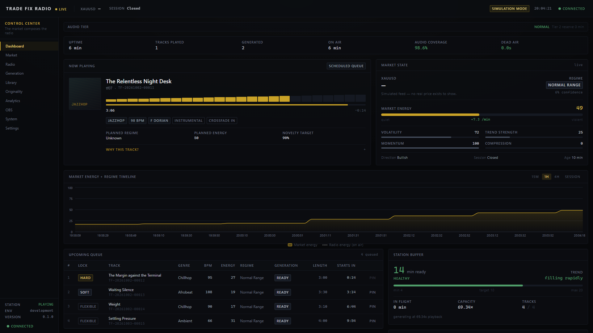
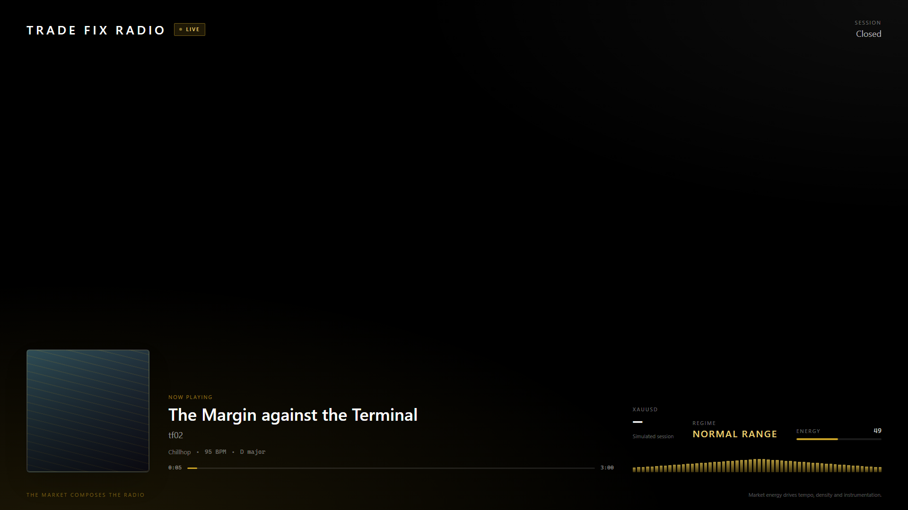

# PHASE 5 REPORT — Control Center and Broadcast Overlay

**Date:** 2026-10-02 · **Status:** complete · **Basis:** `docs/IMPLEMENTATION_PLAN.md` Phase 5
and the Control Center specification (pages 1–10, overlay, acceptance gates A–N)

---

## 1. Summary

There is now a professional broadcast console over the Phase 4 runtime, and a viewer-facing
overlay beside it. Both read the **same running station** — the one the soak and the gates
drive — through an HTTP and WebSocket boundary that was added around the runtime without
changing it.

That last point was the governing constraint and it held: **no file under `radio/`,
`generation/`, `market/` or `director/` gained a method, a field or a callback for the UI's
benefit.** Every figure on screen is read through an accessor Phase 4 already exposed. The two
backend defects fixed during this phase (§6) are both in Phase 5's own code.

| Metric | Phase 4 | Phase 5 |
| --- | --- | --- |
| Python files in package | 102 | **112** |
| **Backend tests passing** | 1 796 | **1 830** |
| Frontend unit/component tests | — | **35** |
| Playwright end-to-end tests | — | **78** (26 × 3 viewports) |
| Screenshots captured and reviewed | — | **34** |
| `ruff` / `mypy` / `tsc` | clean | clean |

```
  tradefix dev --scenario violent_breakout

  TRADE FIX RADIO — THE MARKET COMPOSES THE RADIO
  Control Center   : http://127.0.0.1:8000
  Broadcast overlay: http://127.0.0.1:8000/overlay/live
  API docs         : http://127.0.0.1:8000/api/docs
```

---

## 2. What the first screen answers

The brief lists eleven questions the dashboard must answer immediately. Each is answered by a
named element, and each reads from live runtime state:

| Question | Where |
| --- | --- |
| Is the station broadcasting? | Top bar `LIVE` / `OFF AIR`, from `PlayoutEngine.state` |
| What is playing? | Now Playing — title, persona, genre, BPM, key, elapsed from the engine's frame count |
| What is XAUUSD doing? | Top bar price, Market State panel, energy gauge |
| Why did the system choose this music? | "Why this track?" — the director's **stored** rationale |
| What comes next? | Upcoming Queue with locks, readiness and "starts in" |
| Is AI generation healthy? | Generation strip: §93 capacity, p50/p95, failures, in-flight |
| How much buffer remains? | Station Buffer — minutes, level, thresholds on the meter |
| Is the station at risk of running out? | Buffer trend, and a countdown that appears **only** when shrinking |
| Which emergency tier is active? | Tier banner — subtle when normal, unmissable when not |
| Is OBS connected? | System Health row, reported as Phase 8 rather than faked |
| Is the GPU healthy? | System Health row and the System page, `null` when no GPU exists |



---

## 3. The honesty rules, and how they are enforced

§86 forbids static fake metrics in a production UI, and §51 forbids presenting fabricated
state. Phase 5 enforces those structurally rather than by discipline:

**A capability that does not exist cannot render data.** `api/capabilities.py` reports each
subsystem's state and the phase that delivers it. Originality and OBS return **409 with a
reason**, never 200 with empty arrays — a 200 would let a page draw "0 rejections" for an
engine that does not exist. The UI renders `AwaitingPhase`, which names the phase and states
plainly that nothing shown is simulated.

**`null` means absent, everywhere.** Every formatter returns an em-dash for a missing value.
There is no zero-as-unknown in the DTOs: an unmeasured p95 is `null`, not `0.0s`; an absent GPU
reports `null`, not 0 °C.

**A price is withheld rather than aged.** §21 is enforced in three places, and the strongest is
not mine: `MarketStateV1` **refuses to construct** with a price on a simulated feed. The API
additionally withholds a price from a stale live feed. A test asserts the model-level refusal,
because it is the hardest guarantee in the system.

**The level meter is real or absent.** It is driven by the playout engine's measured peak
sample. When the backend sends no peak, the meter renders "No signal data from the sink" rather
than animating — a decorative waveform would be the single most dishonest pixel available to a
music dashboard, since it would move happily through total silence.

**Simulation is never mistaken for live.** §72's marker sits in the chrome on every page, not in
one panel, and the scenario controls live inside a labelled region.

---

## 4. API

```
GET  /api/health                      liveness, does not touch the station
GET  /api/status                      the whole frame — same payload the socket pushes
GET  /api/station                     station status alone
GET  /api/capabilities                what this build can do
GET  /api/market/current              XAUUSD as the station reads it
GET  /api/market/history?window=      energy timeline + regime change markers
GET  /api/radio/current               now playing, from the playout engine
GET  /api/radio/queue                 upcoming slots with §28 locks
GET  /api/radio/buffer                level, trajectory, trend, time-to-failure
GET  /api/radio/emergency             which tier is carrying the output
GET  /api/radio/history?limit=        recently aired
POST /api/radio/skip                  → PlayoutEngine.request_skip
POST /api/radio/queue/{id}/lock       → OPERATOR_PINNED
POST /api/radio/queue/{id}/unlock     → release the pin, queue recomputes
GET  /api/simulation/scenarios        available scenarios, gated by run mode
POST /api/simulation/regime           → SimulatedFeed.set_scenario
GET  /api/generation/jobs             job monitor
GET  /api/generation/counts           jobs by state
GET  /api/system/resources            CPU, memory, disk, GPU, loop lag, tasks
GET  /api/library/tracks              paginated, filterable
GET  /api/library/tracks/{id}         summary + stored blueprint
GET  /api/analytics?window=           counted aggregates
GET  /api/originality/summary         409 — Phase 6
GET  /api/obs/status                  409 — Phase 8
WS   /ws                              live state
```

**Three mutating endpoints, and no more.** Each maps to a method Phase 4 shipped and tested.
Regenerate, remove, move and preview are *absent* because the runtime has no safe path for them
yet — a button that silently did nothing would be worse than its absence, so the UI renders
those actions as unavailable with a reason.

Each control answers with **what it did**, not `{"ok": true}`: unpinning the queue head replies
that the queue recomputed its lock as `locked`, because §28 derives lock level from position and
forcing `REPLACEABLE` would contradict the queue on its own rule.

### WebSocket protocol

One socket, one envelope shape, two cadences:

```jsonc
{ "type": "state",    "at": "…", "payload": { /* LiveStateV1 */ } }   // every 2 s
{ "type": "position", "at": "…", "payload": { "elapsed_seconds": … } } // every 0.5 s
```

The whole frame is sent together so the dashboard is self-consistent — a buffer reading and the
generator health that explains it always arrive in the same message. Audio position is split out
because it is the only thing that changes continuously, and giving it its own small message is
what lets a progress bar update four times a second while the queue table does not re-render at
all.

A client that falls behind has its oldest messages dropped rather than queued: a browser 32
frames behind wants the *current* state, not a minute of replay.

---

## 5. Frontend

React 18 · TypeScript (strict, `noUncheckedIndexedAccess`) · Vite 6 · Tailwind · Recharts ·
TanStack Query. Nothing existed to reuse; FastAPI and uvicorn were already declared
dependencies from Phase 0.

| Page | State |
| --- | --- |
| 1 Dashboard | ✅ live |
| 2 Market Lab | ✅ live, with scenario controls and regime explanation |
| 3 Radio | ✅ live |
| 4 Generation | ✅ job monitor live; manual **Generation Lab** deferred to Phase 7 (§7) |
| 5 Library | ✅ live, paginated, with stored blueprints |
| 6 Originality | ⏳ designed, `AwaitingPhase 6` |
| 7 Analytics | ✅ live, counted aggregates |
| 8 OBS | ⏳ designed, `AwaitingPhase 8`; overlay URL works today |
| 9 System | ✅ live; watchdog section `AwaitingPhase 9` |
| 10 Settings | ✅ resolved configuration and capabilities, read-only (§7) |
| Overlay `/overlay/live` | ✅ four layouts at 1920×1080 |

**State architecture.** Two React contexts over one socket: `LiveStateContext` for the
structural frame, `PositionContext` for audio progress. A component subscribes to whichever it
needs, which is how the brief's "do not rerender the whole dashboard on every audio-position
event" is satisfied structurally rather than by memoisation discipline. Server state that is
genuinely request-shaped — library pages, analytics windows, job lists — goes through TanStack
Query.

**Bundle.** Code-split so the overlay does not pay for the console: `Overlay` 9.5 kB, `pages`
27.5 kB, `vendor` 205 kB, `charts` 405 kB. The overlay pulls no chart library at all, which
matters because it runs on a streaming machine.

---

## 6. Defects found and fixed

Both backend defects are in Phase 5's own code; the Phase 4 runtime needed no changes.

| # | Defect | How it showed up |
| --- | --- | --- |
| 1 | The dev runner polled the market every 5 s, but the simulator needs 60 ticks per bar | the station's first market state was **5 minutes** away; the scheduler planned nothing and the dashboard opened on an empty Tier 3 broadcast that looked broken |
| 2 | A simulated feed on a real clock cannot classify a regime for 30 minutes | bars are aggregated by wall-clock bucket and the engine needs 30 of them; the console showed `UNKNOWN` at 0 % confidence indefinitely |
| 3 | Market history was recorded as a side effect of serving a browser | the energy timeline only accumulated **while someone was watching** — open the dashboard after an hour of broadcasting and the chart was empty |
| 4 | Composition energy (0–1) and market energy (0–100) were both labelled "Energy" | the queue showed every track at energy "1" and the Why panel read "50 → 1", which looks like the director ignoring the market |
| 5 | The SPA catch-all route returned `FileResponse \| JSONResponse` | FastAPI cannot derive a response model from that union; the server **failed at import** the first time the frontend was built |
| 6 | `RuntimeCoordinator.drain` was already fixed in Phase 4, but the API's own `/status` had no equivalent risk | — |
| 7 | The connection indicator flipped back to "RECONNECTING" on every retry | a station unreachable for ten minutes showed a hopeful amber label instead of settling on OFFLINE |
| 8 | Buffer trend rendered the raw ratio | a mock provider at 63× capacity produced "+4102.3 min/hour" — arithmetically correct, useless, and it made the panel look broken |
| 9 | The timeline's Y axis was 44 px wide | "100" was clipped to "00", which reads as a broken axis |
| 10 | The queue/sidebar split began at 1280 px | at 1366 the queue had ~700 px for eleven columns and **"Starts in" was clipped** — the column an operator reads most |

Three were found in the *tests* rather than the code: `context.setOffline` and CDP offline
emulation both leave an established loopback WebSocket connected, so two versions of the
reconnect test asserted against a socket that had never dropped; and the clipped-content
detector flagged `sr-only` text, which is clipped to one pixel on purpose.

### The catch-up clock

Defect 2 deserves its own note because the fix is a design decision rather than a correction.

The feature engine aggregates ticks into bars by wall-clock bucket, and the regime engine needs
`warmup_bars` of them. On a system clock that is thirty real minutes with no regime. The options
were to fake a regime, to shorten the market's own definition of a bar, or to accept it.

`api/runner.py` takes a fourth: the **feed's** clock starts half an hour behind and the warm-up
winds it forward quickly. The bars that result are real bars of the simulator's real price
process; they simply arrive faster than wall time. When the offset reaches zero the clock *is*
the system clock, so every timestamp from then on is genuine. Only the market feed uses it — the
station, the generator and the playout engine all run on `SystemClock`.

---

## 7. Deliberately not built

**The Generation Lab's manual controls (Page 4).** Manual test generation needs a provider that
can be driven outside the station's scheduling loop, and the mock provider is wired to the
runtime only. Building a form that posted to an endpoint which did not exist would be exactly
the fake-behaviour button the brief rules out. The job monitor — states, leases, attempts,
errors — is live now; the lab arrives with ACE-Step in Phase 7.

**Settings editing (Page 10).** A write path needs validation, restart-impact analysis and
secret masking, and §50 requires that secrets never display unmasked after save. The page shows
the resolved configuration and every capability; `tradefix config` and `.env` remain the way to
change it.

**Queue actions beyond pin/unpin.** Regenerate, remove, move and preview have no safe runtime
path yet.

**Artwork.** Cover art is generated deterministically from the track id and is visibly abstract,
so it is never mistaken for artwork the station does not have. Artwork generation is in no
phase of the plan.

---

## 8. Testing

| Suite | Count | What it covers |
| --- | --- | --- |
| `tests/integration/test_api.py` | 34 | the API against a **real station** on a virtual clock |
| `frontend/src/**/*.test.tsx` | 35 | components, formatting, and the live-state store |
| `frontend/tests-e2e/console.spec.ts` | 78 | the console against a **running** station, ×3 viewports |
| `frontend/tests-e2e/screenshots.spec.ts` | 31 | capture + overflow and clipping checks |
| **Backend total** | **1 830** | Phase 1–5, all passing |

The API tests use a real `RadioStation` — real queue, real playout engine, real generation
manager — because the API's whole job is to report runtime state faithfully, and a mocked
runtime would make them a test of the mock. The Playwright suite drives `tradefix dev`, which is
exactly what an operator runs.

Phase 4's suite is untouched and still green: **100 % audio coverage, zero unintended silence,
queue correctness, generation leases, VirtualClock determinism and playout isolation are all
unchanged**, which the full run confirms.

---

## 9. Design review

Screenshots at all three target resolutions plus the four overlay layouts are in
`frontend/screenshots/`. They were reviewed as artefacts, not assumed correct because tests
passed — which is how defects 4, 8, 9 and 10 were found.

| Viewport | Pages | Result |
| --- | --- | --- |
| 1920×1080 | 10 | ✅ no overflow, no clipping |
| 1440×900 | 10 | ✅ |
| 1366×768 | 10 | ✅ after widening the queue below 1536 px |
| Overlay 1920×1080 | 4 layouts | ✅ |



What the review changed, beyond the defects: the overlay's cover art was nearly invisible at
14 % lightness over video and was brightened with a gold edge; the spectrum was crowding the
footer and was given a row of its own; and the energy timeline's second series was relabelled
**"Radio energy (on air)"** because it trails the market by the depth of the buffer — that lag
is the station scheduling ahead rather than failing to react, and an unlabelled flat line reads
as the director ignoring the market.

### Accessibility

Keyboard navigable with a visible gold focus ring on every interactive element. **Health is
never encoded in colour alone**: every status renders a text label beside a dot whose *shape*
also varies, so a colour-blind operator, a greyscale screenshot and a screen reader all receive
the same information. Charts carry a legend; meters and progress bars carry ARIA roles and
values. `prefers-reduced-motion` disables the pulse animations.

---

## 10. Acceptance gates

| Gate | Result |
| --- | --- |
| A Dashboard shows real runtime state | ✅ |
| B Now Playing updates from the actual PlayoutEngine | ✅ elapsed is the engine's frame count, asserted against `playout.position_seconds` |
| C Queue UI represents real hard/soft/flexible locks | ✅ |
| D Market simulator changes flow through to the UI | ✅ |
| E WebSocket reconnect works | ✅ last state retained and marked stale, recovers unaided |
| F Browser does not require database access | ✅ every read goes through the API |
| G System-health indicators come from actual backend health | ✅ |
| H No fake data appears as real production state | ✅ 409 + `AwaitingPhase`, `null` not zero, price withheld |
| I Dashboard works at all three target resolutions | ✅ |
| J Overlay works at 1920×1080 | ✅ four layouts |
| K Existing backend test suite remains green | ✅ 1 830 passing |
| L Frontend unit/integration suite passes | ✅ 35 |
| M Playwright critical paths pass | ✅ 78 |
| N Visual screenshot review passes | ✅ 34 captured and reviewed |

---

## 11. Known limitations

* **Single-process only.** `tradefix dev` runs API, worker and playout in one loop (§72's
  development mode). ADR-08's three-process production split is Phase 9's. The API reads the
  live `PlayoutEngine` directly, which is what makes "4:12 elapsed" the engine's own frame count
  rather than a reconstruction — a multi-process API would have to infer it.
* **No authentication.** The control token §68 requires for production is not yet enforced on
  these routes. The API binds to `127.0.0.1` by default and the dangerous-endpoint protection
  arrives with the production runner.
* **Market history is in memory.** Four hours at five-second samples, lost on restart. The
  authoritative rows are in `market_states`; the timeline is a display buffer.
* **The energy timeline needs a few minutes of runtime** before it is meaningful, and says so.
* **Analytics covers the tracks table only.** Buffer history and emergency-activation history
  over time need time-series storage that does not exist yet.
* **The overlay's rotation between layouts is manual.** Automatic rotation at safe intervals is
  noted in the brief as a later step.

---

## 12. Next step

**Phase 6 — Audio QC, fingerprinting, originality, mastering.** The Originality page is built
and waiting; when the engine exists, its capability flips to `ready` and the page populates with
measured figures. The `novelty_score` column is already read from the real database column,
which is `NULL` for every track generated before the engine exists — and rendered as absent
rather than as zero.
